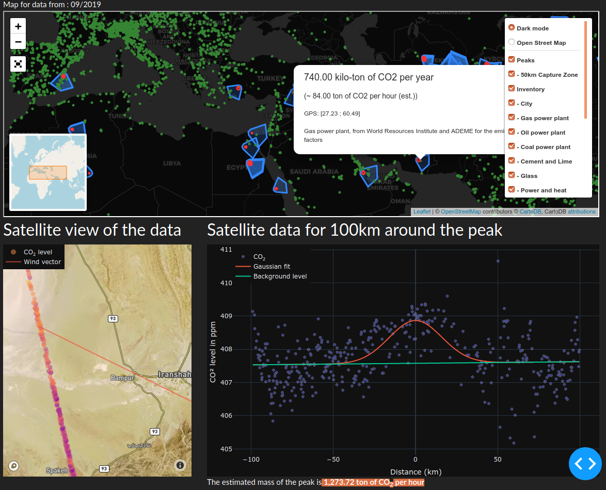

# OCO-2 CO<sub>2</sub> peak detector


## General presentation
> The goal of our project is to localize CO<sub>2</sub> emissions on Earth based on the the carbon concentration data measured by the OCO-2 Satellite from the NASA. 

We are working with:- Matthieu Porte, from IGN who submit the projet- Marie Heckmann, from the French Ministry of Ecology
- Frederic Chevallier, from IPSL, one of the author of [Observing  carbon  dioxide  emissions over  China’s  cities with  the Orbiting Carbon Observatory-2](https://www.atmos-chem-phys-discuss.net/acp-2020-123/acp-2020-123.pdf)

## What we have as input

**1/ OCO-2 Satellite data**


The OCO-2 Satellite (Orbiting Carbon Observatory) from the NASA orbits around Earth and measures the CO<sub>2</sub> concentration in the atmosphere.  

Here is a visualisation of the CO<sub>2</sub> concentration mesured by the OCO-2 satellite in December 2019. 


The satellite uses spectrometers to detect CO<sub>2</sub> in the atmosphere, as shown in the image bellow.


[source](https://commons.wikimedia.org/wiki/File:Artist_rendition_of_the_CO2_column_that_OCO-2_will_see.jpg)

More info here : <https://oco.jpl.nasa.gov/instrument/>

There are some limitations to the satellite measurement of the CO<sub>2</sub> concentration:
- The satellite can not see through clouds or fog;
- It does not work the same over ground or water;
- The swath of the satellite is quite narrow (only 10km), as shown in the image bellow; 
- As the satellite orbits the Earth, the coverage is partial.


!!

More info on the mission on <https://earth.esa.int/web/eoportal/satellite-missions/o/oco-2>.

The NASA made a global CO<sub>2</sub> image (see bellow), however this is an extrapolation of the data, and not what the satellite really see.


**2/ Data on known CO<sub>2</sub> emissions**

- The Emissions Database for Global Atmospheric Research (EDGAR) on CO<sub>2</sub> emissions. For the energy related sectors the activity data is mainly based on the energy balance statistics of IEA (2017), whereas the activity data for the agricultural sectors originates mainly from FAO (2018). The spatial allocation of emissions on the grid is made based on spatial proxy datasets with the location of energy and manufacturing facilities, road networks, shipping routes, human and animal population density and agricultural land use, that vary over time. 
Source : https://edgar.jrc.ec.europa.eu/overview.php?v=50_GHG


- The World Resource Institute provides a list of power plants producing electricity based on different primary energies. We filtered this list to keep only the fossil primary energies (gas, oil and coal), that release CO<sub>2</sub> during their combustion.
Source: http://datasets.wri.org/dataset/globalpowerplantdatabase


- Other sources of CO<sub>2</sub> emissions are under study. 

## What we do


First approach: peak detection from O-CO2 & inference from inventory data

- Detect peak in O-CO2 data, 2 step methodology
	- Step 1: Identification of local ‘peaks’ through Gaussian fits (curve_fit) ; Taking into account intrinsic complexity of O-CO2 data, notably: High variance across ‘background’ CO<sub>2</sub> level across the globe, narrowness & incompleteness of plumes observations (due to clouds / fogs / …), ...
	- Step 2: Elimination of irrelevant peaks to keep only ‘true’ anomalies: So far, through a quite drastic & manual methodology, with rules to keep only clear Gaussians ; Objective to improve this part with algo-based anomaly detection 

- Aggregate known sources of CO<sub>2</sub> from inventory data: Using EDGAR & World Resource Institute

- Find nearest inventory from peak position, using the wind vector.

- Compare peak to known sources emissions and confirm them

Second approach: supervised model to learn to detect peaks from inventory data [not started]
- Use areas where inventory data are complete to let a supervised model learn peaks in OCO2 data

On top: dynamic visualization of data
- Display the result on a comprehensive map, crossing satellite & inventory data

## What we have achieved

 - Gather data from EDGAR and World Resource Institute and plotted them on a map.
 - Get raw satellite data from NASA and merge the to monthly dataset with the data we need.
 - Compute a Gaussian curve fit over each orbit and save the results.
 - Interactive dasboard to share our work on the web.
 
Here is a sample of a peak witth the gaussian found :


And the result on the website :




## We need help

- Better peak detection: So far, we are fitting Gaussian curves to detect relevant peaks. 2 issues:
    - We use SciKit Learn curve_fit. Do you know a better algorithme or how to tune parameters of curve_fit ?
    - We are looking at other methodologies to detect anomalies (our 'peaks') in the concentrations  - any idea? 
- Wind modeling to estimate emission from detected concentration - any idea? (inverting the Gaussian plume model)


## Git directories structure
* /dataset contains a sample of OCO-2 data and inventory data; _**Important**_ : The whole datas are in a shared Open Stack Storage, not in the Github.
* /notebooks contains the notebooks made by the team;
* /pipeline contains the scripts used to process the NASA's data.
* /oco2peak containts the modules

**Warning** : The project use NBDev so the doc (including this README !) and the modules ar generated from Notebooks. So you have only to edit the Notebooks.

## Open Stack directories structure

We do not store the original OCO-2 files from NASA.

* /emissions/ contains all the potential source of emissions : factories, power plants, cities...
* /soudings/ contains CSV of the raw features extracted from NASA NC4 files.
* /peaks-detected/ contains all the peak found in the satellite orbit datas.
* /peaks-detected-details/ contains one JSON file of the full data for all detected peak

## Install

### Python Package Only
If you are interested to use only our modules for your own project :
`pip install oco2peak`

### With Docker

#### For use only
`
docker-compose up
`

Front on http://localhost:7901

#### For dev

`docker-compose -f docker-compose-dev.yml up`

- Front on http://localhost:7901
- Jupyter Lab on http://localhost:7988

### Dataset access

You need a config.json with token to your OpenStack:
```json
{
    "swift_storage": {
        "user":"B..r",
        "key":"ep..ca",
        "auth_url":"https://auth.cloud.ovh.net/v3/",
        "tenant_name":"8..8",
        "auth_version":"3",
        "options" : {
            "region_name": "GRA"
        },
        "base_url" : "https://storage.gra.cloud.ovh.net/v1/AUTH_2...d/oco2/"
    }
}
```

```python
config = '../configs/config.json'
datasets = Datasets(config)
datasets.get_files_urls(prefix="/datasets/oco-2/peaks-and-invent/", pattern='1908')
```


    ['https://storage.gra.cloud.ovh.net/v1/AUTH_2aaacef8e88a4ca897bb93b984bd04dd/oco2//datasets/oco-2/peaks-and-invent/peaks_and_invent_1908.csv']


```python
datasets.get_files_urls(prefix="/map/peaks_map/", pattern='1908')
```


    ['https://storage.gra.cloud.ovh.net/v1/AUTH_2aaacef8e88a4ca897bb93b984bd04dd/oco2//map/peaks_map/peaks_capture_map_1908.html']


### Upload a file

```python
datasets.upload(mask='../*.md', prefix="/Trash/",content_type='text/text')
```


<div>
    <style>
        /* Turns off some styling */
        progress {
            /* gets rid of default border in Firefox and Opera. */
            border: none;
            /* Needs to be in here for Safari polyfill so background images work as expected. */
            background-size: auto;
        }
        .progress-bar-interrupted, .progress-bar-interrupted::-webkit-progress-bar {
            background: #F44336;
        }
    </style>
  <progress value='1' class='' max='1', style='width:300px; height:20px; vertical-align: middle;'></progress>
  100.00% [1/1 00:00<00:00]
</div>


<div>
    <style>
        /* Turns off some styling */
        progress {
            /* gets rid of default border in Firefox and Opera. */
            border: none;
            /* Needs to be in here for Safari polyfill so background images work as expected. */
            background-size: auto;
        }
        .progress-bar-interrupted, .progress-bar-interrupted::-webkit-progress-bar {
            background: #F44336;
        }
    </style>
  <progress value='3' class='' max='3', style='width:300px; height:20px; vertical-align: middle;'></progress>
  100.00% [3/3 00:01<00:00]
</div>


## Build docs and modules

`make all`

Or if you are using Docker:

`docker exec -it batch7_satellite_ges_oco2-dev_1 make all`


# Process NASA Files

In `docker-compose-dev.yml` change `source: /media/NAS-Divers/dev/datasets/` to the path to you NC4 files.

Then run :
`docker-compose -f docker-compose-dev.yml up`

In another terminal, run:

```bash
docker exec -it batch7_satellite_ges_oco2-dev_1 /bin/bash
python pipeline/01_extract_nc4_to_csv.py
python pipeline/02_find_peak_in_all_files.py
python pipeline/03_upload_json_to_the_cloud.py
```
